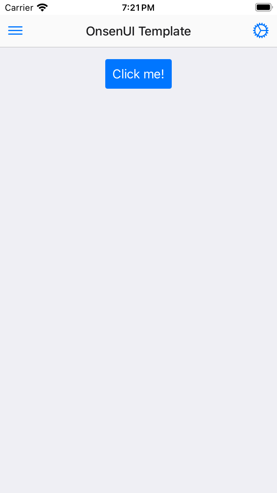

# OnsenUI Template

A simple Swift Playground where [OnsenUI](https://onsen.io) is already configured in a simple UIKit webview.

## iPhone 



## iPad


## Code

```html
<!DOCTYPE html>
<html lang="en">
<head>
    <meta charset="UTF-8">
    <meta name="viewport" content="width=device-width, initial-scale=1.0, maximum-scale=1.0, user-scalable=no, viewport-fit=cover'">
    <link rel="stylesheet" href="onsenui.min.css">
    <link rel="stylesheet" href="onsen-css-components.min.css">
    <link rel="stylesheet" href="ionicons.min.css">
</head>
<body>
  <ons-page>
    <ons-toolbar>
      <div class="left">
        <ons-toolbar-button>
          <ons-icon icon="ion-ios-menu"></ons-icon>
        </ons-toolbar-button>
      </div>
      <div class="center">OnsenUI Template</div>
      <div class="right">
        <ons-toolbar-button>
          <ons-icon icon="ion-ios-cog"></ons-icon>
        </ons-toolbar-button>
      </div>
    </ons-toolbar>
    <p style="text-align: center">
      <ons-button>Click me!</ons-button>
    </p>
  </ons-page>
    <script src="onsenui.min.js"></script>
</body>
</html> 
```